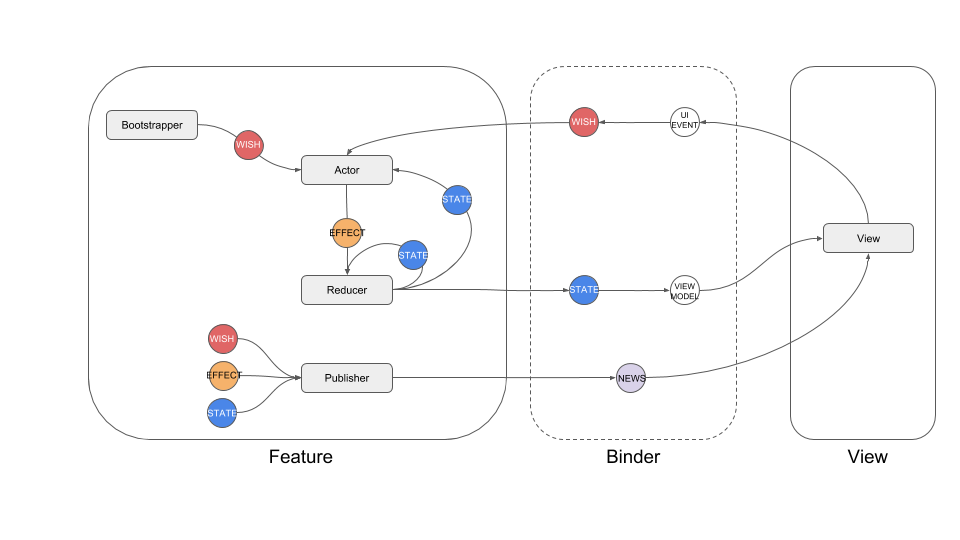

## How it works

The businsss logic resides inside the **Feature**.

### State diagram

### The Feature
Inside the Feature we find:
   * The **Reducer**: it produces **States** when receiving a previous state or an **Effect**
   * The **Actor**: it produces effects based on other states or **Wishes**. This is where most of the logic actually is,
   especially because this is where user interaction (in the form of wishes) happens.
   * The **Publisher**: it emits one-off effects called **News**.

### The View and the Binder
The View binds tho the Feature via the **Binder**, receives *States* and emits *Wishes* that cause
effects and subsequent states.

#### The View is completely decoupled from the Feature
   * *States* are transformed into **ViewModels** that are actually used by the View to render on screen;
   * the view emits **UiEvents** that are mapped to *Wishes*.
