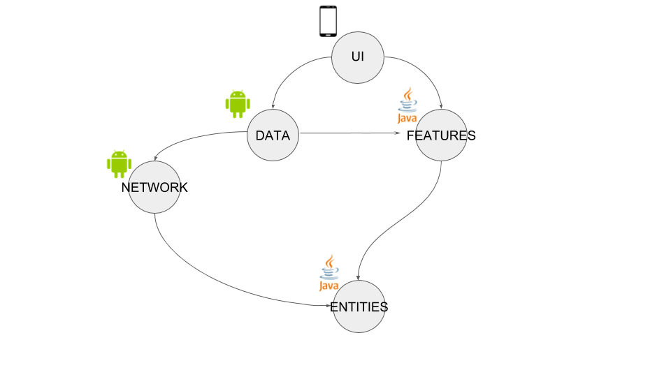

## Project modules
   * **entities** (Java Library): it contains the essential definitions (like ComicsBook).
   * **features** (Java Library): it contains the the business logic (the Feature).
   * **network** (Android Library): it contains the networking classes.
   * **data** (Android Library): it contains the **database** and the implementation of the Repository that is
   used by the app.
   * **ui**: is the Android application

### Dependency graph

The arrow points in the direction of the dependency.

